<p align="center">
  
</p>

<p align="center">
  
  
  
  
  
  
</p>

# The Cabin: conference hall booking demo

A complete, clickable demo of an hourly booking platform for a single conference hall. Guests can watch the space, check live availability, book specific hours, pay online and receive a confirmation email. The venue team gets an admin console for slots, pricing, approvals, clients, payments, analytics and email templates.

> **This is a front-end demo.** There is no backend. All data is realistic dummy data stored in the visitor's browser, payments are simulated in test mode, and emails are rendered and logged instead of sent. Every screen and flow works end to end, so it can be shown to a client as if it were live.

---

## Contents

- [Highlights](#highlights)
- [How a booking works](#how-a-booking-works)
- [Features: guest website](#features-guest-website)
- [Features: admin console](#features-admin-console)
- [Screenshots](#screenshots)
- [Tech stack](#tech-stack)
- [Architecture](#architecture)
- [Project structure](#project-structure)
- [Getting started](#getting-started)
- [Try the demo](#try-the-demo)
- [Customising for a client](#customising-for-a-client)
- [Deploying to Vercel](#deploying-to-vercel)
- [Taking it to production](#taking-it-to-production)
- [Known limitations](#known-limitations)

---

## Highlights

- **Hourly booking with live availability.** A calendar plus an hour grid that hides booked, blocked, closed and past hours, and prevents overlapping bookings.
- **Razorpay-style checkout.** UPI with QR code, cards, netbanking and wallets, with processing, success and failure animations.
- **Instant confirmation.** A confirmation page with the rendered email, a printable GST invoice and an add-to-calendar file.
- **Full admin console.** Dashboard analytics, booking approval and modification, manual entry, slot and price control, client history, payment tracking, editable HTML email templates and review moderation.
- **Client portal.** Guests look up their bookings by mobile number, download invoices, cancel upcoming bookings and leave reviews.
- **Realistic dummy data.** About 120 bookings across 16 client organisations over six months, generated deterministically so every visitor sees the same starting state.

---

## How a booking works

<p align="center">
  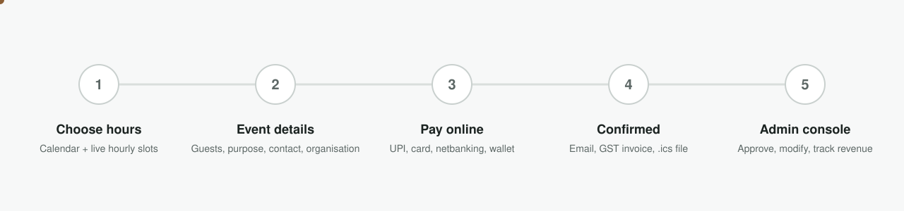
</p>

1. **Choose hours.** The guest picks a date, then taps a start hour and an end hour. The price updates as they select.
2. **Event details.** Number of guests, purpose, contact person, mobile, email, place and organisation details, with an optional GSTIN for a GST invoice.
3. **Pay online.** A simulated Razorpay checkout opens with the exact amount including 18% GST.
4. **Confirmed.** The booking is saved, a confirmation email and invoice are "sent", and the guest lands on a confirmation page.
5. **Admin console.** The booking appears instantly in the admin console. If auto-confirm is off, it waits in Pending for the venue team to approve.

<p align="center">
  
</p>

---

## Features: guest website

### Landing page

| Section | What it does |
|---|---|
| Video hero | Full-screen hero that plays the venue video at `public/media/hall.mp4`. A photo with a slow drift shows until the video starts, so the page never looks empty. |
| Next available slot | Reads live availability and shows the next bookable block and its hourly rate, for example "Today, from 18:00, ₹2,500 per hour". |
| The space | Floor area, capacity, ceiling height, hours, weekday and weekend rates, minimum booking, and capacity per seating layout. Rates come from the admin pricing settings. |
| Gallery | Full-bleed photo mosaic of the hall. |
| Facilities | Twelve included facilities, such as air conditioning, a 4K projector, audio, Wi-Fi, video conferencing, power backup, catering, parking and step-free access. |
| How booking works | A three-step explainer. |
| Reviews | The three latest published reviews, linking to the full reviews page. |
| Footer | Address, phone, email, hours, GSTIN and site links. |

### Booking page (`/book`)

- A calendar that disables past dates, closed weekdays, blocked dates and dates beyond the advance-booking window.
- An hourly slot grid with four states: available, selected, booked and unavailable.
- Range selection: tap a start hour, then tap the last hour you need. The minimum booking length is enforced.
- Required fields: date, time, number of guests, purpose of booking, contact person name, place, mobile number, email and organisation name.
- Optional fields: GSTIN, billing address and special requests.
- Inline validation with clear messages, covering 10-digit Indian mobile numbers, email format, GSTIN format and the capacity limit.
- A sticky price summary showing rate × hours, GST and total.
- A double-booking guard: if someone else takes the slot during checkout, the booking is rejected with a clear message.

### Simulated Razorpay checkout

- A merchant panel showing the price summary and the payer's contact details.
- Four payment methods:
  - **UPI/QR:** a scannable-looking QR code or a UPI ID field.
  - **Cards:** test card details are pre-filled.
  - **Netbanking:** bank selection, then a mock bank page with **Success** and **Failure** buttons so both outcomes can be demonstrated.
  - **Wallets.**
- Animations for processing, with a spinner and step messages, success, with a checkmark, rings and a confetti burst, and failure, with a retry option.
- A test transaction ID in Razorpay's `pay_…` format.

### Confirmation page (`/booking/[id]`)

- Booking summary with transaction ID and status.
- Live preview of the confirmation email exactly as the guest receives it.
- Buttons to open the printable invoice, download an `.ics` calendar file and open the client portal.

### GST invoice (`/invoice/[id]`)

- Venue and client details with GSTINs, SAC code 997212, hours and rate.
- CGST and SGST split for Kerala clients, or IGST for clients in other states.
- Print or save as PDF straight from the browser.

### Client portal (`/portal`)

- Sign in with the mobile number used for booking.
- Totals for bookings, hours hosted and total spend.
- Upcoming bookings with invoice, calendar and cancel actions. Cancelling triggers a refund and a cancellation email.
- Booking history with a "leave a review" link for completed bookings.

### Reviews (`/reviews`)

- Average rating and all published reviews.
- A review form, pre-filled with the guest's details when opened from a review request email or the portal.
- Reviews of 4 stars and above go live immediately. Lower ratings are held for moderation.

---

## Features: admin console

The admin console lives at `/admin`. There is no login in the demo.

### Dashboard

- KPIs: revenue this month with change versus last month, bookings this month, occupancy for the next 30 days, average booking value and outstanding dues.
- Charts: monthly revenue for the last six months, bookings by purpose, peak hours and demand by weekday.
- An "Awaiting approval" list with one-click confirm, and a "Coming up" list of the next confirmed events.

### Bookings

- Filter tabs for upcoming, pending, confirmed, completed, cancelled and all, with counts.
- Search by name, organisation, mobile, email, ID or purpose.
- A detail drawer for each booking, showing:
  - event, contact, organisation and payment details;
  - **Confirm**, **Record payment**, **Modify**, **Invoice**, **Send email**, **Ask for review** and **Cancel** actions;
  - a log of every email sent for that booking, with previews;
  - the client's other bookings.
- **Manual booking** for phone, walk-in and corporate bookings, with the same slot picker, every booking field, booking status, payment status and method, and an option to email the client.
- **Modify booking**: change slot or details. The price is recalculated and clashes are blocked.
- CSV export of the current filtered view.

### Slots & availability

- Weekly schedule: open or close each weekday and set opening and closing hours.
- An advance-booking window, for example 90 days ahead.
- A daily slot editor: pick any date and click individual hours to block or reopen them. Booked hours show the client's name.
- Block a whole day with a reason, such as maintenance or a private event, and manage the list of blocked dates.
- Changes appear on the public booking page immediately.

### Pricing

- Weekday and weekend hourly rates, minimum hours, maximum guests and GST rate.
- An **auto-confirm** switch. When on, paid online bookings are confirmed instantly. When off, they wait in Pending for approval.
- A price preview table showing what customers pay for common durations.

### Clients

- A client list built from every booking and keyed by mobile number, showing organisation, place, number of bookings, lifetime spend and last booking.
- A client drawer with totals and a full booking history timeline. Click any booking for its details.

### Payments

- Totals for amount collected, GST collected, outstanding and refunded.
- A chart of amount collected per payment method.
- A transactions table filtered by status, with **Mark paid** for pending dues.

### Email templates

Five editable HTML email templates. Each uses table layout and inline styles so it renders correctly in Gmail and Outlook.

| Template | Sent when |
|---|---|
| Booking confirmed | A booking is confirmed, automatically or by the admin |
| Tax invoice | A paid online booking is confirmed |
| Review request | The admin asks a past client for feedback |
| Booking received | A booking is waiting for approval |
| Booking cancelled | A booking is cancelled by the guest or the admin |

- Edit the subject and the HTML with a live preview filled from a real booking.
- 23 placeholders, such as `{{customer_name}}`, `{{date}}`, `{{time}}`, `{{total}}`, `{{txn_id}}`, `{{invoice_link}}` and `{{review_link}}`. Click a placeholder to copy it.
- Reset any template to its default, or send a test.
- A **Sent log** of every email the system has "sent", with previews.

### Reviews

- Publish or hide any review.
- Rating summary and distribution.
- Send review requests to past clients one at a time, or to the latest 10 in one click.

### Demo controls

- **Reset demo data** in the sidebar restores the original dummy data at any time.

---

## Screenshots

### Guest website

| Landing | Booking |
|---|---|
| 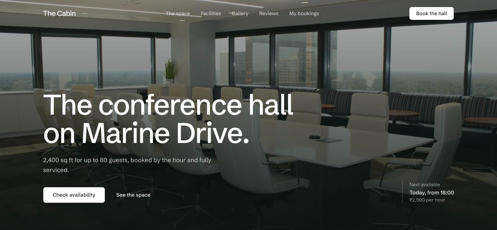 | 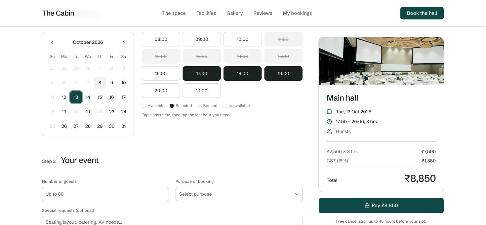 |
| **Confirmation with email preview** | **GST invoice** |
| 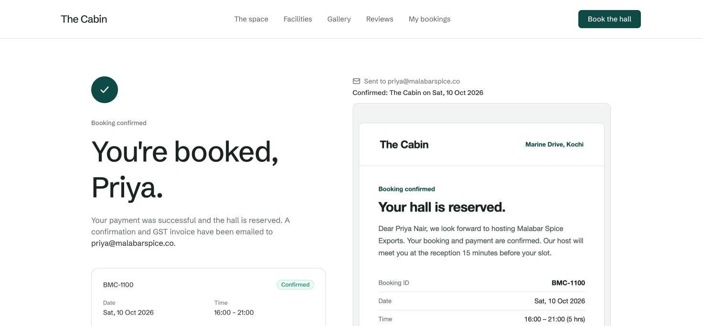 | 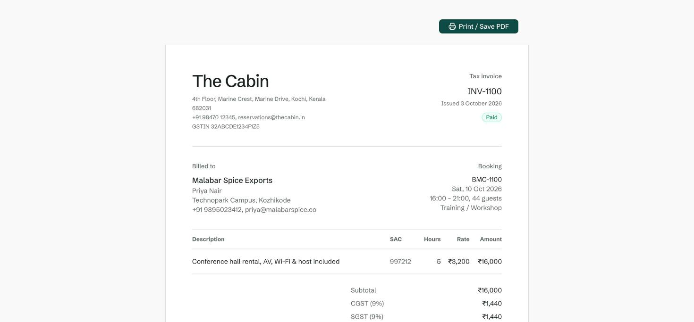 |

### Admin console

| Dashboard | Bookings |
|---|---|
| 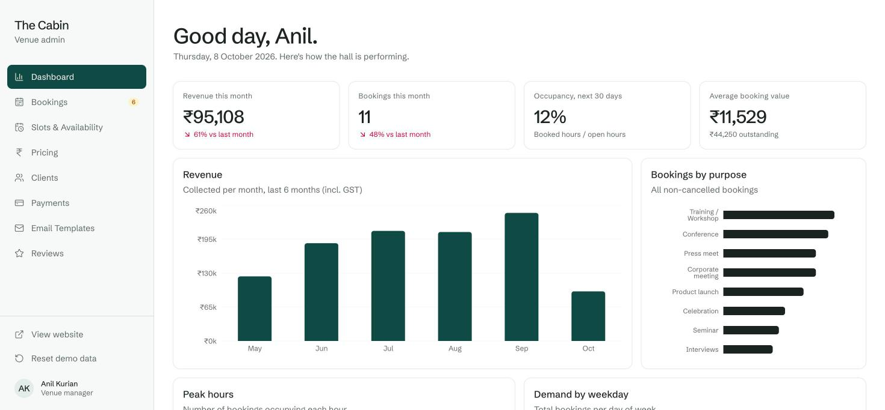 | 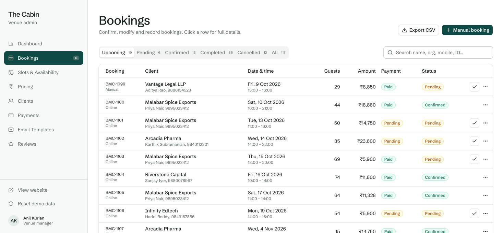 |
| **Slots & availability** | **Payments** |
| 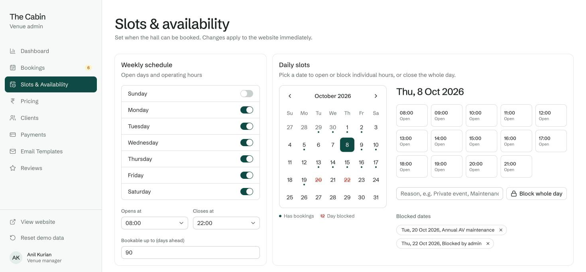 | 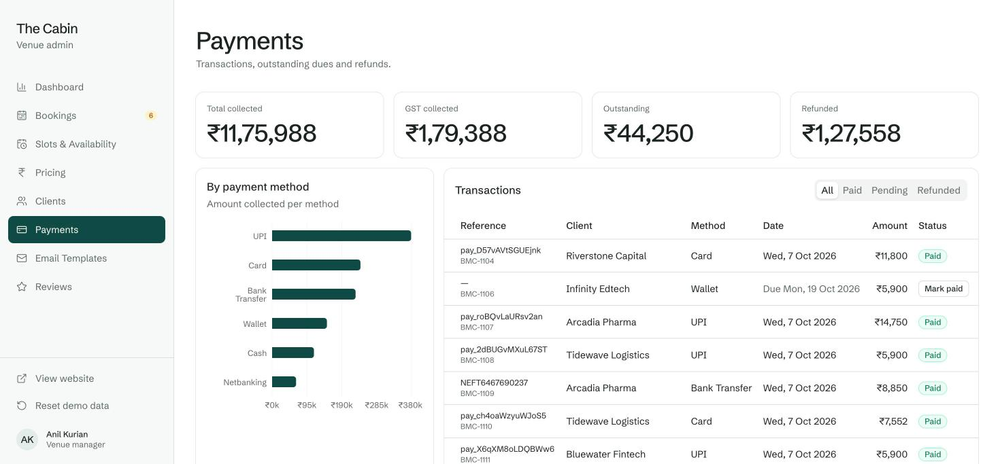 |
| **Email templates** | |
| 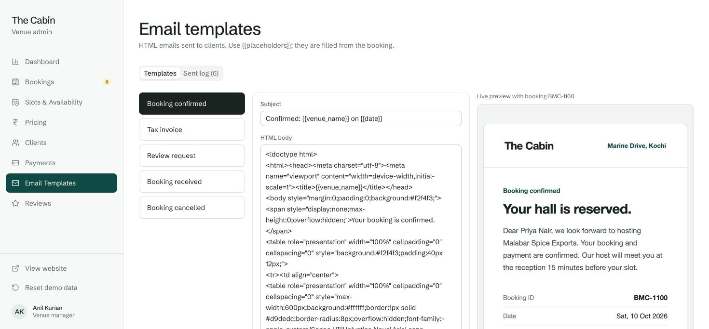 | |

---

## Tech stack

| Area | Choice | Why |
|---|---|---|
| Framework | [Next.js 16](https://nextjs.org) (App Router) + React 19 | Routing, layouts and one-click Vercel deploys |
| Language | TypeScript 5 | Shared types for bookings, settings and templates |
| UI components | [shadcn/ui](https://ui.shadcn.com) on [Base UI](https://base-ui.com) | Accessible dialogs, sheets, selects, tabs and menus |
| Styling | [Tailwind CSS 4](https://tailwindcss.com) | Design tokens in a single CSS file |
| State and persistence | [Zustand 5](https://zustand.docs.pmnd.rs) with `persist` | One store, saved to `localStorage` |
| Charts | [Recharts 3](https://recharts.org) via shadcn charts | Dashboard and payment analytics |
| Animation | [Framer Motion](https://motion.dev) | Checkout and confirmation animations |
| Dates | [date-fns 4](https://date-fns.org) + react-day-picker | Calendars and date maths |
| Icons and toasts | [Lucide](https://lucide.dev), [Sonner](https://sonner.emilkowal.ski) | Icons and confirmation messages |
| Type | Schibsted Grotesk (Google Fonts) | A single typeface across site, admin and emails |

---

## Architecture

<p align="center">
  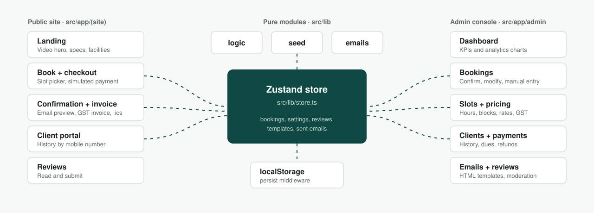
</p>

- **One store, two front ends.** The guest website and the admin console read and write the same Zustand store. A booking made on `/book` appears in `/admin` immediately, and a slot blocked in admin disappears from `/book` immediately.
- **Pure logic modules.** Pricing, availability, client grouping and validation live in `src/lib/logic.ts`, with no React. Email rendering lives in `src/lib/emails.ts`, and dummy data in `src/lib/seed.ts`.
- **Deterministic seed.** Dummy data is generated by a seeded random number generator relative to today's date. The demo always looks current and is the same for every visitor.
- **Hydration-safe persistence.** The store skips automatic hydration and is rehydrated after mount by `StoreHydrator`, so server-rendered markup always matches the first client render.

### Data model

```ts
Booking {
  id: "BMC-1042", date: "2026-10-13", start: 17, hours: 3,
  pax, purpose, contactName, place, mobile, email,
  organisation, orgAddress?, gstin?, notes?,
  subtotal, tax, total,
  status: "pending" | "confirmed" | "completed" | "cancelled",
  payment: { status: "paid" | "pending" | "refunded", method, txnId?, paidAt? },
  source: "online" | "manual", createdAt, reviewRequested?
}

Settings {
  openDays[7], openHour, closeHour, weekdayRate, weekendRate,
  minHours, maxPax, taxRate, autoConfirm, advanceDays,
  blockedDates: { date, reason }[], blockedSlots: { [date]: hour[] }
}
```

Clients are not stored separately. They are derived from bookings and grouped by mobile number, so history is always consistent.

---

## Project structure

```
src/
├── app/
│   ├── (site)/                 Guest website with shared header and footer
│   │   ├── page.tsx            Landing page
│   │   ├── book/               Booking form and checkout
│   │   ├── booking/[id]/       Confirmation page
│   │   ├── portal/             Client portal
│   │   └── reviews/            Reviews
│   ├── admin/                  Admin console with sidebar layout
│   │   ├── page.tsx            Dashboard
│   │   ├── bookings/  availability/  pricing/
│   │   └── clients/   payments/      emails/   reviews/
│   ├── invoice/[id]/           Printable GST invoice
│   ├── layout.tsx              Fonts, toaster, store hydrator
│   └── globals.css             Design tokens (colours, radius, type)
├── components/
│   ├── site/                   Header, footer, hero, next-slot, reviews
│   ├── admin/                  Sidebar, booking dialog, booking drawer
│   ├── shared/                 Email preview frame, status badges
│   ├── slot-picker.tsx         Calendar and hourly slot grid
│   ├── razorpay-checkout.tsx   Simulated payment gateway
│   └── ui/                     shadcn/ui components
└── lib/
    ├── venue.ts                Venue copy, capacity, facilities, gallery
    ├── types.ts                Shared types
    ├── logic.ts                Pricing, availability, validation
    ├── emails.ts               HTML email templates and placeholders
    ├── seed.ts                 Dummy data generator
    ├── store.ts                Zustand store and actions
    └── ics.ts                  Calendar file export
scripts/check-logic.ts          Self-check for pricing and availability
docs/                           README images and animations
public/images, public/media     Venue photos and hero video
```

---

## Getting started

Requirements: Node.js 20 or later, and pnpm.

```bash
git clone https://github.com/NXYH/cabinbooking-demo.git
cd cabinbooking-demo
pnpm install
pnpm dev
```

Open http://localhost:3000.

| Script | What it does |
|---|---|
| `pnpm dev` | Start the development server |
| `pnpm build` | Production build |
| `pnpm start` | Serve the production build |
| `pnpm lint` | ESLint |
| `pnpm check` | Run the pricing and availability self-check (Node 22.6 or later) |

---

## Try the demo

| What to try | Where |
|---|---|
| Book a slot and pay | `/book`: pick a date and hours, fill the form, pay with any method |
| See a failed payment | In checkout, choose Netbanking, pick a bank, then click **Failure** |
| Look up a returning client | `/portal` with mobile **9847012301** |
| Approve a pending booking | `/admin`, under Awaiting approval, click **Confirm** |
| Add a phone booking | `/admin/bookings`, then **Manual booking** |
| Block a maintenance day | `/admin/availability`, then pick a date and **Block whole day** |
| Change prices | `/admin/pricing`. New prices show on the site immediately |
| Require approval for online bookings | `/admin/pricing`, then turn off **Auto-confirm** |
| Edit the confirmation email | `/admin/emails` |
| Start fresh | **Reset demo data** in the admin sidebar |

---

## Customising for a client

| What | Where |
|---|---|
| Hero video | Add `public/media/hall.mp4`. MP4/H.264, under 20 MB, about 1080p, no audio needed. |
| Hero and gallery photos | `public/images/` and the `gallery` list in `src/lib/venue.ts` |
| Venue name, address, phone, email, GSTIN, capacity, layouts, facilities | `src/lib/venue.ts` |
| Booking purposes | `PURPOSES` in `src/lib/venue.ts` |
| Default rates, hours, GST, blocked dates | `defaultSettings()` in `src/lib/seed.ts`, or live from the admin console |
| Colours, radius, typography | Tokens at the top of `src/app/globals.css`. One brand colour, `--brand`, drives buttons, charts and focus rings. |
| Email design and copy | `src/lib/emails.ts`, or live from Admin → Email templates |
| Dummy clients and reviews | `src/lib/seed.ts` |

After changing seed data, click **Reset demo data** in the admin console. You can also bump the storage key in `src/lib/store.ts` so every visitor gets the new data.

---

## Deploying to Vercel

1. Push this repository to GitHub.
2. Go to [vercel.com/new](https://vercel.com/new) and import the repository.
3. Keep the defaults. Vercel detects Next.js and pnpm, and no environment variables are needed.
4. Click **Deploy**.

If the build fails with a pnpm version error, add `ENABLE_EXPERIMENTAL_COREPACK=1` as an environment variable in the project settings and redeploy. Every push to `main` redeploys automatically.

---

## Taking it to production

The demo is built so each simulated part can be swapped for a real service without touching the UI.

| Demo piece | Production replacement |
|---|---|
| Zustand store with localStorage | A database such as Postgres, behind API routes or server actions. The actions in `src/lib/store.ts` map one-to-one to endpoints. |
| `razorpay-checkout.tsx` | Razorpay Checkout.js, plus a server-side order creation and signature verification webhook |
| Emails logged to the sent log | An email provider such as Resend or SES, sending the same HTML from `src/lib/emails.ts` |
| Open admin console | Authentication with role-based access for the admin routes |
| Client portal lookup by mobile | Mobile OTP verification before showing booking history |
| Slot availability check in the browser | A database-level constraint or transaction so two people can never book the same hour |

---

## Known limitations

- Data lives in each visitor's browser, so two people never see each other's bookings.
- No real payments, emails, SMS or authentication.
- Refunds are recorded as a status change only.
- The hero shows a photo until a video is added at `public/media/hall.mp4`.
- Venue details, photos and dummy data are placeholders.

---

<p align="center">
  Built as a client demo with Next.js and shadcn/ui.
</p>
